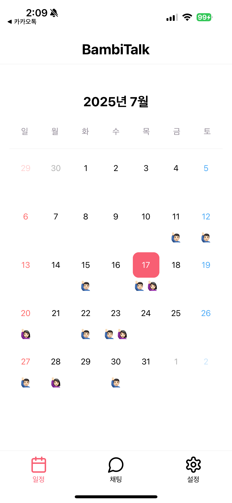
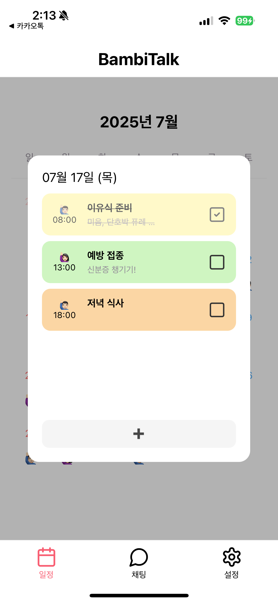
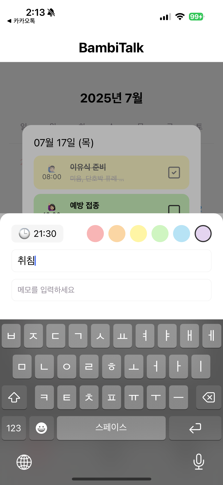
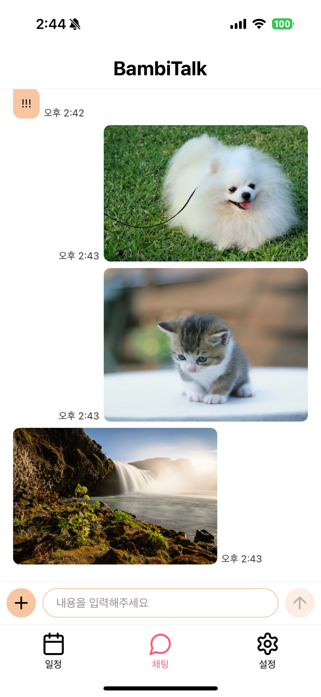
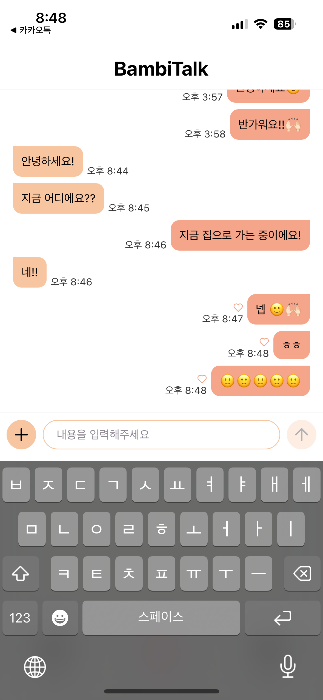
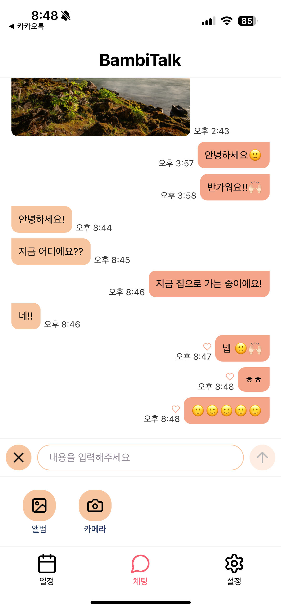

# 🧡 BambiTalk

<p align="center">

</p>
<center>

**BambiTalk은 부부 또는 커플이 아기 출산 전후의 육아 일정을 함께 관리하고, 실시간 채팅을 통해 소통할 수 있도록 도와주는 전용 소통 앱입니다.**

일정과 할 일, 메시지를 한 곳에서 공유하며 육아에 필요한 커뮤니케이션을 더 쉽고 효율적으로 만들어줍니다.

</center>

<br/>

# 📖 목차

- [🧡 BambiTalk](#🧡-bambitalk)
- [🛠️ Tech Stacks](#🛠️-tech-stacks)
- [🧐 Motivation](#🧐-motivation)
- [🕹️ Features](#🕹️-features)
- [🔥 Challenges](#🔥-challenges)
  - [1. 실시간 채팅으로 사진 및 동영상 파일 전송하기 📬](#1-실시간-채팅으로-사진-및-동영상-파일-전송하기-📬)
    - [1.1. 화면 포커스 처리 방식](#11-화면-포커스-처리-방식)
    - [1.2. 파일 전송과 메시지 전송을 분리](#11-화면-포커스-처리-방식)
  - [2. 메시지 읽음 처리 기능 구현 👀](#2-메시지-읽음-처리-기능-구현-👀)
    - [2.1. 클라이언트에서의 메시지 수신 및 읽음 처리](#21-클라이언트에서의-메시지-수신-및-읽음-처리)
    - [2.2. 서버에서의 읽음 처리](#22-서버에서의-읽음-처리)
    - [2.3. 클라이언트에서 실시간 읽음 처리](#23-클라이언트에서-실시간-읽음-처리)
  - [3. Redis를 활용하여 초대코드로 1:1 커플 매칭 구현](#3-redis를-활용하여-초대코드로-11-커플-매칭-구현)
    - [3.1. 발급한 초대코드를 어디에 저장할까?](#31-발급한-초대코드를-어디에-저장할까)
    - [3.2. Redis 키 설계](#32-redis-키-설계)
- [🔗 Repository Links](#🔗-repository-links)
- [🗓️ Schedule](#🗓️-schedule)

<br/>

# 🛠️ Tech Stacks

## Client


## Server


## Test


<br/>

# 🧐 Motivation

기존의 육아 관련 앱들은 대부분 정보 제공이나 커뮤니티 중심으로 구성되어 있어, **부부 또는 커플이 함께 일정을 관리하고 실시간으로 소통할 수 있는 전용 앱**은 찾기 어려웠습니다.

육아는 한 사람만의 몫이 아니며, 함께 계획하고 실행하는 과정이 매우 중요합니다.<br/>
하지만 실제로는 서로의 일정이나 할 일을 공유하기 어렵고, 커뮤니케이션도 여러 앱을 오가며 번거롭게 이루어지는 경우가 많습니다.

**BambiTalk은 이러한 문제를 해결하기 위해, 육아 일정과 할 일을 함께 관리하고 실시간 채팅으로 소통할 수 있는 ‘1:1 육아 전용 소통 앱’을 목표로 개발**되었습니다.

<br/>

# 🕹️ Features

BambiTalk은 다음과 같은 기능에 집중합니다.

## 1. 함께 쓰는 육아 일정 & 할 일 관리

누가 어떤 일정을 등록했는지, 오늘 해야 할 일이 무엇인지 한눈에 확인하고 함께 관리할 수 있어요.<br/>
캘린더에는 부부 중 누가 일정을 등록했는지 이모지로 구분되며,
각 일정은 시간순으로 정리되고 완료 여부도 체크박스로 간단하게 표시할 수 있습니다.

<details>
<summary>이미지 보기</summary>
<p align="center">
  
  
  
</p>
</details>

## 2. 실시간 커플 채팅 기능

소중한 육아 대화를 위한 전용 채팅방!

서로의 메시지를 실시간으로 주고받고, 일정이나 할 일과 연결된 커뮤니케이션도 매끄럽게 이어집니다.<br/>
또한, 사진과 동영상도 자유롭게 전송할 수 있어 육아 순간을 생생하게 공유할 수 있습니다.

<details>
<summary>이미지 보기</summary>
<p align="center">
  
  
  
</p>
</details>

<br/>

# 🔥 Challenges

## 1. 실시간 채팅으로 사진 및 동영상 파일 전송하기 📬

BambiTalk의 채팅 기능은 단순한 텍스트 메시지를 넘어, 사진과 동영상 같은 미디어 파일도 주고받을 수 있도록 설계되었습니다.<br/>
초기에는 WebSocket 기반 채팅에 파일 전송 기능을 추가하기 위해, 파일을 `base64`로 인코딩해 소켓 메시지에 포함시키는 방식을 선택했습니다.

### 🚨 문제 상황

갤러리에서 선택한 이미지는 문제없이 전송되었지만, 카메라로 직접 촬영한 사진이나 동영상을 전송할 경우, 소켓 연결이 예기치 않게 끊어지는 문제가 발생했습니다.

<br/>

### 1.1. 화면 포커스 처리 방식

처음에는 이 문제가 **화면 포커스 처리 방식 때문**이라고 판단했습니다.<br/>
현재 채팅방은 `useFocusEffect` 훅을 이용해, 화면에 진입하면 소켓을 연결하고 벗어나면 해제하는 구조로 되어 있습니다.<br/>
이로 인해 외부 앱인 카메라를 실행하면서 채팅방 포커스가 잠시 해제되고, 그 순간 소켓 연결이 끊기는 것으로 보였습니다.

이를 해결하기 위해, 기존에 `useRef`로 관리하던 소켓 객체를 Zustand 스토어로 옮겨 **전역에서 소켓 상태를 유지하는 구조로 변경**했습니다.

하지만 구조 개선 이후에도 동일한 문제가 발생했고, 결국 **근본적인 원인은 전송 방식 자체에 있음을 확인**했습니다.

카메라로 촬영한 파일은 기본적으로 용량이 크고, 이를 base64로 인코딩해 WebSocket으로 전송하는 과정에서 데이터 크기가 과도하게 증가했습니다.<br/>
이로 인해 소켓 연결이 과부하로 끊기는 현상이 발생한 것입니다.<br/>
즉, WebSocket을 통해 대용량 바이너리 데이터를 직접 전송하는 방식은 기술적으로 구조적 한계가 있는 방식이었습니다.

<br/>

### 1.2. 파일 전송과 메시지 전송을 분리

이 문제를 해결하기 위해, 파일 전송과 메시지 전송을 완전히 분리하는 구조로 리팩토링을 진행했습니다.

- 파일 업로드 전용 API (`POST /api/v1/files`)를 구현했습니다.
- 클라이언트에서는 촬영하거나 선택한 파일을 해당 API에 먼저 업로드합니다.
- 서버는 파일을 S3에 저장한 뒤, 클라이언트에 `Signed URL`을 응답으로 반환합니다.
- 이후 클라이언트는 이 URL과 메시지 타입(예: IMAGE, VIDEO)만 포함한 메시지를 WebSocket으로 전송합니다.
- 결과적으로 WebSocket 메시지에는 실제 파일 데이터가 아닌, 가볍고 안전한 링크 정보만 포함됩니다.

이 구조를 통해 대용량 전송으로 인한 소켓 연결 종료 문제를 해결할 수 있었고, 실시간성과 안정성을 모두 갖춘 미디어 메시지 전송 기능을 완성할 수 있었습니다.

이번 경험을 통해, WebSocket은 텍스트 기반 실시간 통신에는 적합하지만, 대용량 바이너리 데이터를 직접 다루는 데는 한계가 있다는 점을 다시 한번 깨달을 수 있었습니다.

---

<br/>

## 2. 메시지 읽음 처리 기능 구현 👀

기존의 채팅 기능에 더해, 메시지 읽음 상태를 실시간으로 정확하게 반영하는 기능을 구현하고자 했습니다.

처음에는 읽음 상태 동기화를 위해 `Polling` 방식도 고려했지만, 다음과 같은 이유로 적합하지 않다고 판단했습니다.

- 서버에 주기적으로 상태를 요청해야 하므로 트래픽과 리소스 낭비.
- 사용자가 실제로 메시지를 읽은 시점과 동기화에 시간차가 발생할 수 있음.

대신 WebSocket을 활용해, 다음 두 가지 상황에서만 읽음 처리를 수행하는 방식으로 방향을 잡았습니다

1. 사용자가 채팅방에 접속했을 때
2. receive_message 이벤트에 응답했을 때

이 두 시점은 **모두 사용자가 실제로 메시지를 보고 있는 상태임을 의미**하기 때문에,
별도의 주기적 확인 없이도 읽음 상태를 정확하고 실시간으로 반영할 수 있다고 판단했습니다.

<br/>

### 2.1. 클라이언트에서의 메시지 수신 및 읽음 처리

클라이언트는 채팅방에 접속한 상태에서 메시지를 수신하면, 즉시 `read_all_messages` 이벤트를 서버에 전송합니다.
이 이벤트는 메시지를 실제로 읽은 순간 발생하므로, 읽음 처리 타이밍이 명확합니다.

```ts
socketInstance.on('receive_message', (message) => {
  handleMessageReceived(message);
  readAllMessages(); // read_all_messages 이벤트 emit
});

.
.
.

const readAllMessages = () => {
  if (!socket) return;

  socket.emit('read_all_messages');
};
```

또한 소켓 연결 직후(채팅방 진입 시)에도 서버 측에서 자동으로 읽음 처리를 수행할 수 있도록 구현했습니다.

<br/>

### 2.2. 서버에서의 읽음 처리

서버는 다음 두 가지 상황에서 읽음 처리 로직을 실행합니다

<br/>

1. **소켓 연결 시점**

- 클라이언트가 채팅방에 입장하면, 해당 커플 방(`couple-{id}`)에 소켓을 join합니다.
- 그 직후, DB에서 해당 유저가 보내지 않은 모든 메시지를 읽음 처리하고,
- 같은 방에 있는 상대방에게 `update_read_status` 이벤트를 전송하여, 상대방 화면에서도 메시지가 읽힌 상태로 표시되도록 합니다.

<br/>

2. **`read_all_messages` 이벤트 수신 시**

- 사용자가 메시지를 수신하고 읽음 요청을 보내면, 서버는 동일한 처리를 반복합니다.

  ```ts
  @SubscribeMessage('read_all_messages')
  async readAllMessages(@ConnectedSocket() client: Socket) {
    await this.messageUseCase.readAllMessages(client.data.coupleId, client.data.userId);
    this.server.to(`couple-${client.data.coupleId}`).emit('update_read_status', client.data.userId);
  }
  ```

<br/>

### 2.3. 클라이언트에서 실시간 읽음 처리

이 구조를 통해, 사용자가 실제로 메시지를 읽은 시점에만 서버와 읽음 상태를 동기화하며,
상대방은 `update_read_status` 이벤트를 통해 자신의 메시지가 읽혔음을 실시간으로 확인할 수 있습니다.

<p align="center">
<image src="docs/read-chat.gif" width="300" />
</p>

---

<br/>

## 3. Redis를 활용하여 초대코드로 1:1 커플 매칭 구현

BambiTalk의 모든 일정, 채팅, 알림 기능은 커플 단위(coupleId)로 연동되어야 정상적으로 동작합니다.

하지만 회원가입 직후에는 두 사용자가 서로 연결되어 있지 않기 때문에,
초대 코드를 통해 서로를 연결한 뒤, 커플로 매칭된 상태에서만 서비스를 온전히 이용할 수 있도록 설계했습니다.

<br/>

### 3.1. 발급한 초대코드를 어디에 저장할까?

초대 코드를 발급한 뒤, 이를 어디에 저장하고 어떻게 관리할지 고민이 필요했습니다.<br/>
처음에는 DB의 `Couple` 테이블에 `inviteCode` 컬럼을 추가해 관리하는 방식을 고려했지만,
이 경우 **초대 코드 유효성 확인을 위해 매번 DB를 조회해야 하는 비효율적인 구조**라고 판단했습니다.

대신, 만료 시간 설정과 자동 삭제가 가능한 **Redis**를 사용하기로 결정했습니다.<br/>
Redis를 활용하면 초대 코드가 일정 시간이 지나면 자동으로 삭제되므로,
별도의 정리 작업 없이도 가볍고 효율적인 관리가 가능해졌습니다.

<br/>

### 3.2. Redis 키 설계

초대 코드를 Redis에 저장할 때, 다음과 같이 두 가지 키 구조로 분리하여 설계했습니다.

| **키 이름**                | **역할**                                     | **TTL** |
| -------------------------- | -------------------------------------------- | ------- |
| `invite:{inviteCode}`      | 코드 입력 시 조회용 -> coupleId, userId 저장 | 15분    |
| `couple:{coupleId}:invite` | 중복 발급 방지용 -> inviteCode 저장          | 15분    |

<br/>

1. **`invite:{code}` — 코드 입력 시 조회용**

- 초대코드를 받은 사용자가 초대 코드를 입력했을 때, 해당 코드가 어떤 커플(`coupleId`)에 속한 것이며, 누가 초대한(`userId`) 것인지를 즉시 조회하기 위해 사용됩니다.
- 이 키 하나만으로 초대 코드의 **유효성 검증**과 **연결 대상 정보 확인이 가능**하며,
- 코드 사용이 완료되면 해당 키만 삭제해도 관련 정보가 모두 제거됩니다.

2. **`couple:{coupleId}:invite` — 중복 발급 방지용**

- 한 커플이 여러 초대 코드를 동시에 발급하지 못하도록 제한하기 위해 추가한 키입니다.
- 초대 코드를 발급할 때, 먼저 이 키가 존재하는지 확인하여 **기존 코드가 아직 유효한 경우에는 재발급하지 않도록 처리**합니다.
- 만료시간(TTL)을 설정함으로써, 초대 코드 유효 시간이 지나면 자동으로 만료되도록 관리합니다.
- 이 키로 인해 초대 코드 발급 로직에서 중복 생성을 효과적으로 방지할 수 있습니다.

<br/>

이처럼 초대 코드 자체의 정보와, 커플 단위로 발급 여부를 체크하기 위한 정보를 분리해 저장함으로써,
초대 코드 기능을 보다 안정적으로 설계할 수 있었습니다.

<br/>

# 🔗 Repository Links

[클라이언트 레포지토리](https://github.com/soo96/bambitalk-app) |
[서버 레포지토리](https://github.com/soo96/bambitalk-api)

<br/>

# 🗓️ Schedule

프로젝트 기간 : 2025.06.23(월) ~ 2025.07.18(금)

- 1주차 : 아이디어 선정 및 기회
- 2~4주차 : 개발

<br/>

# 추가 기능 구현 계획

### 2주차

- 채팅 앱 푸시 알림 기능
- 일정 등록 및 하루 전 리마인드 푸시 알림 기능
- 채팅 탭버튼 안읽음 메시지 카운트 뱃지
- 애플 로그인

### 3주차

- 테스트코드 작성
- 게스트 로그인 기능
- 웹소켓 부하 테스트
